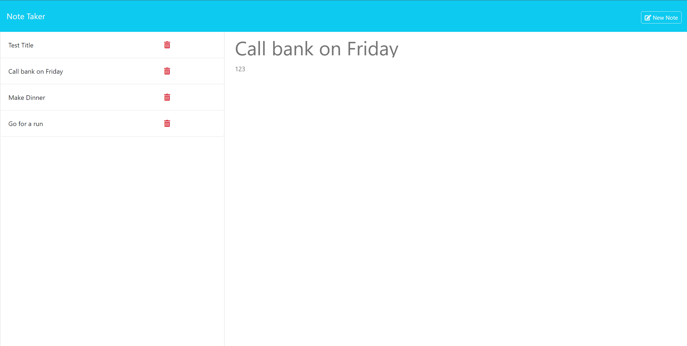

# Note-Taker

## Description

The Note Taker Application is a versatile and user-friendly digital tool designed to cater to the needs of small business owners, students, professionals, or anyone seeking an efficient way to organize their thoughts and tasks. This application seamlessly combines the convenience of note-taking with the power of digital technology, making it an essential companion for modern-day productivity.

Please see the live webpage link for you to checkout. [Heroku Note Taker](https://note-taker-mee-b84c7795516f.herokuapp.com/)

## User Story

```
AS A small business owner
I WANT to be able to write and save notes
SO THAT I can organize my thoughts and keep track of tasks I need to complete
```

## Acceptance Criteria

```
GIVEN a note-taking application
WHEN I open the Note Taker
THEN I am presented with a landing page with a link to a notes page
WHEN I click on the link to the notes page
THEN I am presented with a page with existing notes listed in the left-hand column, plus empty fields to enter a new note title and the note’s text in the right-hand column
WHEN I enter a new note title and the note’s text
THEN a "Save Note" button and a "Clear Form" button appear in the navigation at the top of the page
WHEN I click on the Save button
THEN the new note I have entered is saved and appears in the left-hand column with the other existing notes and the buttons in the navigation disappear
WHEN I click on an existing note in the list in the left-hand column
THEN that note appears in the right-hand column and a "New Note" button appears in the navigation
WHEN I click on the "New Note" button in the navigation at the top of the page
THEN I am presented with empty fields to enter a new note title and the note’s text in the right-hand column and the button disappears
```

 ## Screenshot

  The following image shows the README application's appearance and functionality:

  
  
  ## Table of Contents
  - [Description](#description)
  - [User Story](#user-story)
  - [Acceptance Criteria](#acceptance-criteria)
  - [Screenshot](#screenshot)
  - [Installation](#installation)
  - [Usage](#usage)
  - [Questions](#questions)

   ## Usage

To use the Note Taker application, follow these steps:

1. Visit the application's URL [Note Taker](https://note-taker-mee-b84c7795516f.herokuapp.com/).

2. You will be presented with a landing page with a link to the notes page. Click on the "Get Started" button to access the notes page.

3. On the notes page, you will see a list of existing notes in the left-hand column and empty fields to enter a new note's title and text in the right-hand column.

4. To create a new note, enter a title and text in the input fields.

5. After entering the note content, a "Save Note" button and a "Clear Form" button will appear in the navigation at the top of the page.

6. Click on the "Save Note" button to save the new note. The note will be added to the list of existing notes in the left-hand column, and the navigation buttons will disappear.

7. To view an existing note, click on the note's title in the left-hand column. The selected note will appear in the right-hand column, and a "New Note" button will appear in the navigation.

8. Click on the "New Note" button to clear the note and create a new one.

9. To delete an existing note, click the trash can icon next to the note in the list.

## Installation

To run the Note Taker there is no installation requirements.

## License
[](https://opensource.org/licenses) This project is licensed under the MIT License.

 ## Questions
If you have any questions or encounter any issues, please feel free to [open an issue](https://github.com/mxrtinee/Note-Taker/issues) or contact me directly:<br>
GitHub: [Mxrtinee](https://github.com/Mxrtinee)<br>
Email: [hello@martinestrada.dev](mailto:hello@martinestrada.dev)